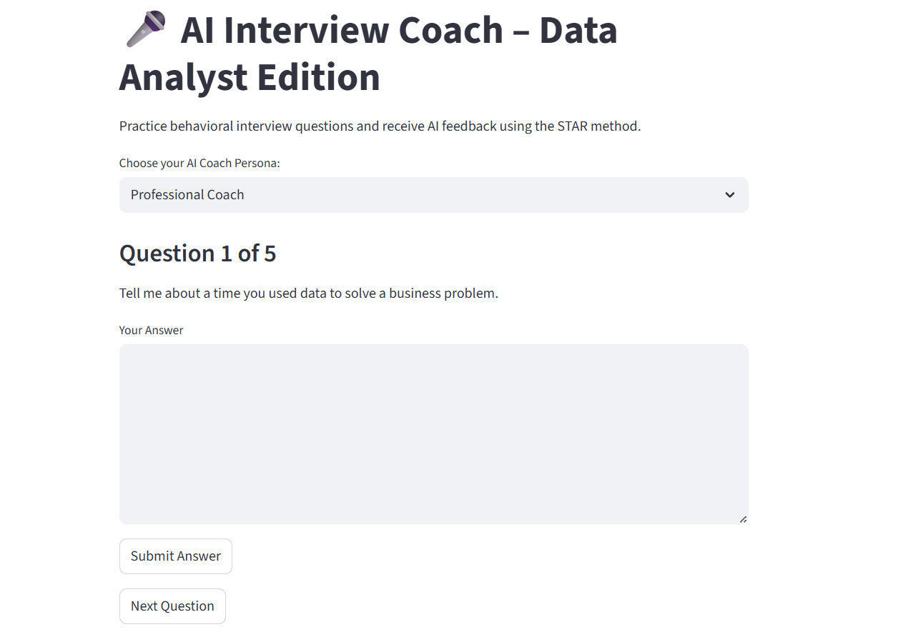

# 🎤 AI Interview Coach – Data Analyst Edition

An interactive AI-powered interview coaching tool built with Python and Streamlit.  
This app helps aspiring data analysts prepare for real-world behavioral interviews using the STAR method — with real-time AI feedback and a downloadable PDF summary.

---

## 📌 Project Overview

**AI Interview Coach – Data Analyst Edition** is a Streamlit-based application that simulates behavioral interview practice by offering 5 carefully selected data analyst interview questions. Users respond in free-text format and receive instant AI-generated feedback tailored to their selected coaching persona.

Whether you're preparing for your first job or brushing up your communication skills, this tool helps you practice responses, identify improvements, and download a full PDF summary of your performance.

---

## 🚀 Live Demo

👉 [Launch the App in Streamlit](https://ai-interview-coach-data-analyst-edition-6v8hscouvvdum2cpw6dctt.streamlit.app/)

---

---

## 🧠 Key Features

- 🎯 **5 Curated Behavioral Interview Questions** focused on common scenarios for data analysts  
- 🧑‍🏫 **AI Persona Selector** with 4 distinct review styles:
  - `Professional Coach`: Encouraging, structured feedback using STAR method
  - `Mentor`: Supportive and constructive suggestions
  - `Technical Reviewer`: Critical and technical analysis of your response
  - `Tough Critic`: Blunt and honest reviewer with direct feedback
- 💬 **Live AI Feedback** using OpenAI's `gpt-3.5-turbo` model
- 📝 **Progress Tracker** to show which question you’re on
- 📄 **PDF Summary Generator** at the end of the interview — includes:
  - All questions  
  - Your answers  
  - The AI’s detailed feedback

---

## ⚙️ Tech Stack

| Component      | Description                                 |
|----------------|---------------------------------------------|
| `Python`       | Main programming language                   |
| `Streamlit`    | UI framework for building web apps          |
| `OpenAI API`   | To generate AI feedback via GPT-3.5 Turbo   |
| `FPDF`         | Used to generate downloadable PDF summaries |

---

## 🛠 Project Phases

### Phase 1: Question Design & Persona Prompting  
- Curated 5 behavioral questions relevant to data analyst interviews  
- Designed unique system prompts for 4 coaching personas  
- Stored questions in a structured JSON file

### Phase 2: UI Development with Streamlit  
- Built a user-friendly interface using `streamlit`  
- Implemented question display, persona selector, text input, and feedback display

### Phase 3: OpenAI API Integration  
- Integrated `gpt-3.5-turbo` to generate persona-based feedback  
- Managed user session state to store all Q&A progress  
- Added error handling and user prompts

### Phase 4: PDF Summary Generator  
- Built a custom PDF report using `fpdf`  
- Added a download button that appears only after completing all questions  
- The PDF includes: all questions, user responses, and the AI’s feedback

### Phase 5: Cloud Deployment  
- Deployed the app publicly on [Streamlit Cloud](https://streamlit.io/cloud)  
- Secured API keys using `.streamlit/secrets.toml`

---

## 📢 Want to Practice Smarter?

Try the app here → [Launch Interview Coach](https://ai-interview-coach-data-analyst-edition-6v8hscouvvdum2cpw6dctt.streamlit.app)
